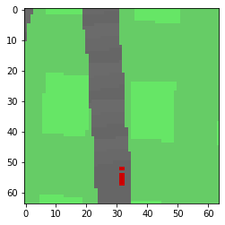
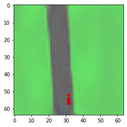
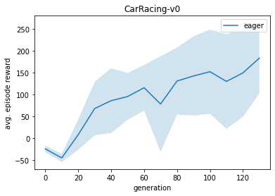
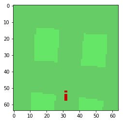
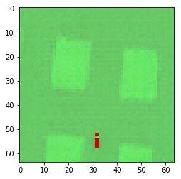
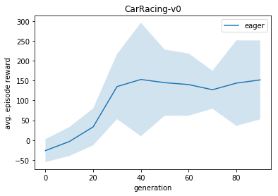

# World Models
This repo reproduces the [original implementation](https://github.com/hardmaru/WorldModelsExperiments) of [World Models](https://arxiv.org/abs/1803.10122). This implementation uses TensorFlow 2.2.

## Docker
The easiest way to handle dependencies is with [Nvidia-Docker](https://github.com/NVIDIA/nvidia-docker). Follow the instructions below to generate and attach to the container.
```
docker image build -t wm:1.0 -f docker/Dockerfile.wm .
docker container run -p 8888:8888 -v /home/ubuntu/wm:/app -it wm:1.0
docker attach wm
```

## Visualizations
To visualize the environment from the agents perspective or generate synthetic observations use the [visualizations jupyter notebook](WorldModels/visualizations.ipynb). It can be launched from your container with the following:
```
jupyter notebook --no-browser --port=8888 --ip=* --allow-root
```

## Project progress:
### Task 1
[PaperWork](./World_Models_reports.pdf)

### Task 2
I am able to set up the environment and reproduce the result. However, due to the limitation of the computing power, the result I get is worse than the one in original repo.

- [extract.py](WorldModels/extract.py) 
Using 4 workers to generate 640 random scenes. Each scene contains maximumly 1000 frames and minimumly 100 frames. They are saved in [record](WorldModels/results/WorldModels/CarRacing-v0/record)

- [vae_train.py](WorldModels/vae_train.py) 
load the scenes from record folder, With the [args](./WorldModels/configs/carracing.config) fed. Train the model with [Vae architecture](./WorldModels/vae/vae.py).

- [series.py](WorldModels/series.py) 
series the data, which can be found [here](./WorldModels/results/WorldModels/CarRacing-v0/series/series.npz)

- [rnn_train.py](WorldModels/rnn_train.py)
Train the RNN model with [architecture](./WorldModels/rnn/rnn.py). The result can be found [here](./WorldModels/results/WorldModels/CarRacing-v0/tf_rnn)

- [train.py](WorldModels/train.py)
Generate real Car Racing environment and train with previous results and 4 workers. The result can be seen [here](./WorldModels/results/WorldModels/CarRacing-v0/log)

- [car_racing.ipynb](WorldModels/car_racing.ipynb)
visualize vae reconstructed image and the score evolution over time.


Real Frame Sample             |  Reconstructed Real Frame
:-------------------------:|:-------------------------:|
|  


#### Reproducing Results From Scratch
##### CarRacing-v0
To reproduce results for CarRacing-v0 run the following bash script
```
bash launch_scripts/carracing.bash
```

#### Score
We only run for 130 generations and with 640 rollouts, 4 workers. I made rnn_batch_size = 5.



### Task 3

The rollouts I used are the same as in previous part
- [vaegan_train.py](WorldModels/vaegan_train.py)
Train the vaegan with the model architecture as [vaegan](./WorldModels/vaegan.py). I got the idea from https://github.com/leoHeidel/vae-gan-tf2

- [vaegan_series.py](WorldModels/vaegan_series.py)
serialize the vaengan parameters.

- [vaegan_rnn_train.py](WorldModels/vaegan_rnn_train.py)
Train the same rnn model with [architecture](./WorldModels/vaegan_rnn.py). The result can be found [here](./WorldModels/results/WorldModels/CarRacing-v0/vaegan_rnn)

- [train2.py](WorldModels/train2.py)
Generate real Car Racing environment and train with 4 workers. The [controller](./WorldModels/vaegan_controller.py) and [env](./WorldModels/vaegan_env.py) are changed to use the vaegan model. The results can be found [here](./WorldModels/results/WorldModels/CarRacing-v0/vaegan_log)

- [vaegan_visualization.ipynb](WorldModels/vaegan_visualization.ipynb)
visualize vae reconstructed image and the score evolution over time with VAEGAN model.

Real Frame Sample             |  Reconstructed Real Frame
:-------------------------:|:-------------------------:|
|  


#### Reproducing Results From Scratch
```
CUDA_VISIBLE_DEVICES=0 python3 vaegan_train.py -c configs/carracing.config
CUDA_VISIBLE_DEVICES=0 python3 vaegan_series.py -c configs/carracing.config
CUDA_VISIBLE_DEVICES=0 python3 vaegan_rnn_train.py -c configs/carracing.config
CUDA_VISIBLE_DEVICES=-1 xvfb-run -a -s "-screen 0 1400x900x24 +extension RANDR" -- python3 train2.py -c configs/carracing.config
```

#### Score
We only run for 90 generations and with 640 rollouts, 4 workers. I made rnn_batch_size = 5. In my opinion, the score can definitely get higher after more generations.

